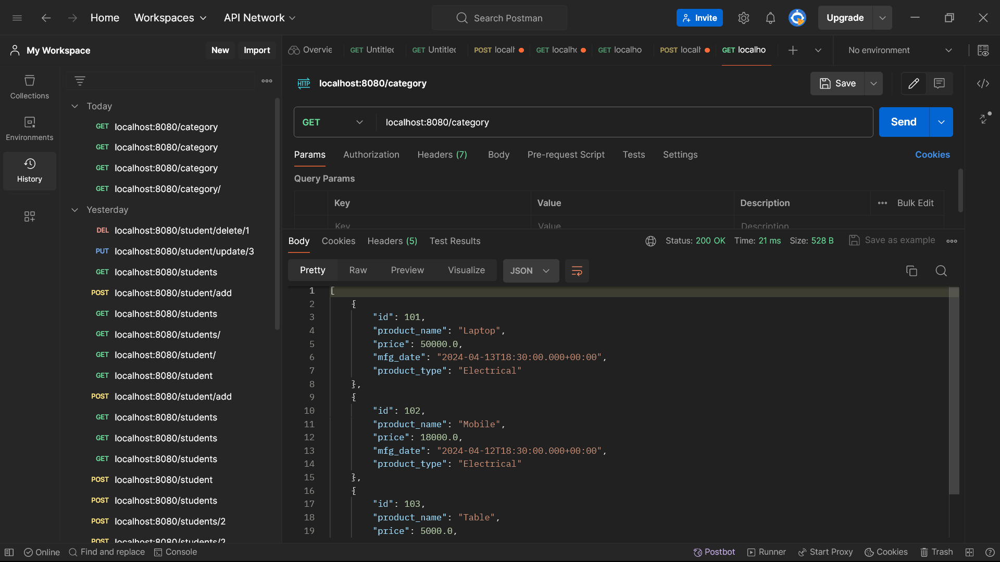
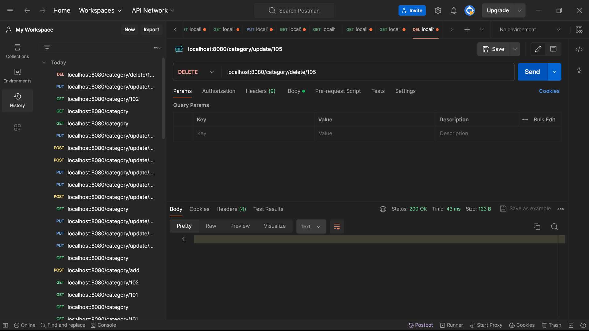

<!DOCTYPE html>
<html lang="en">
<head>
    <meta charset="UTF-8">
    <meta name="viewport" content="width=device-width, initial-scale=1.0">
</head>
<body>
<H1>Java Machine Test</H1>
<H3>This CRUD operation 
use in :-
 </H3>
 

1.SpringBootTool Suite

2.annotation

3.JAP & Hibernate

4.Tesing PostMan

 
<h4>1) Category CRUD operation.</h4>
    
Below are the APIs required to be developed 

 <table border="1"> 
        <tr> 
            <td>1</td> 
            <td>http://localhost:8080/category</td> 
            <td>GET all the categories</td> 
        </tr>
        <tr> 
            <td>2</td> 
            <td>http://localhost:8080/category/add </td> 
            <td>POST - create a new category</td> 
        </tr> 
        <tr> 
            <td>3</td> 
            <td>http://localhost:8080/category/102</td> 
            <td>GET category by Id</td> 
        </tr> 
     <tr> 
            <td>4</td> 
            <td> http://localhost:8080/product/delete/{id} </td> 
            <td>DELETE - Delete category by id</td> 
        </tr> 
        <tr> 
            <td>5</td> 
            <td>http://localhost:8080/category/update/{id}   </td> 
            <td>PUT - update category bin Id</td> 
        </tr> 
    </table> 

 
 
<h4>2) Product CRUD operation.</h4>
    
Below are the APIs required to be developed 

 <table border="1"> 
        <tr> 
            <td>1</td> 
            <td>http://localhost:8080/product</td> 
            <td>GET all the product</td> 
        </tr>
        <tr> 
            <td>2</td> 
            <td>http://localhost:8080/product/add </td> 
            <td>POST - create a new product</td> 
        </tr> 
        <tr> 
            <td>3</td> 
            <td>http://localhost:8080/product/102</td> 
            <td>GET product by Id</td> 
        </tr> 
     <tr> 
            <td>4</td> 
            <td> http://localhost:8080/product/delete/{id} </td> 
            <td>DELETE - Delete product by id</td> 
        </tr> 
        <tr> 
            <td>5</td> 
            <td>http://localhost:8080/product/update/{id}   </td> 
            <td>PUT - update product bin Id</td> 
        </tr> 
    </table> 
     
</li>

    
</body>
</html>

